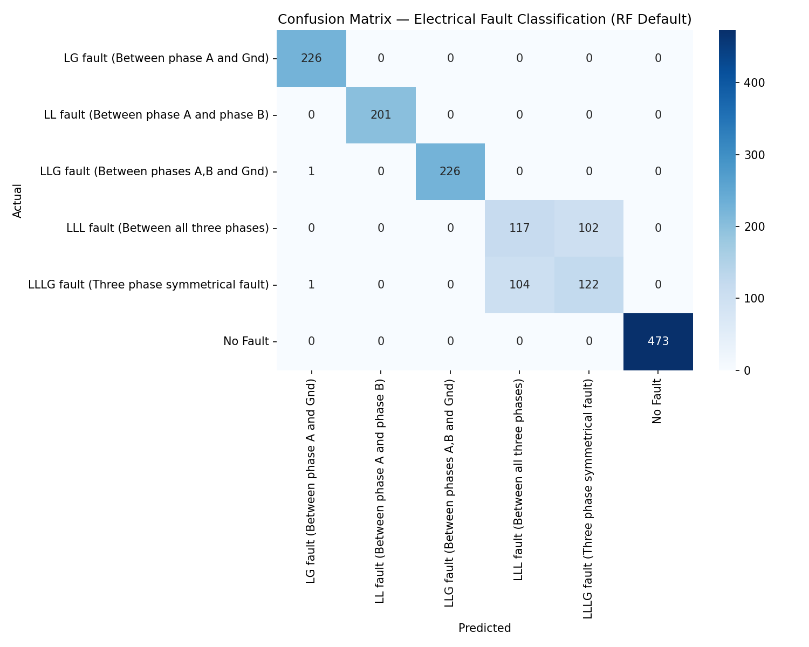

# RF-ElectricalFault-Classifier

A structured study of **Random Forest classification** applied to electrical fault
detection and fault-type identification in simulated three-phase power grid systems.

Built as direct preparatory research for **SmartNode-PK** — a Final Year Design Project
deploying a quantized Random Forest model on ESP32 for real-time fault detection in
low-voltage Pakistani power networks.

---

## Results Summary

| Model | Overall Accuracy | Macro F1 |
|---|---|---|
| RF Default | **87%** | 0.84 |
| RF Balanced (`class_weight='balanced'`) | **87%** | 0.85 |

| Fault Type | Precision | Recall | F1 |
|---|---|---|---|
| LG — Line-to-Ground (Phase A) | 0.99 | 1.00 | **1.00** |
| LL — Line-to-Line (Phase A-B) | 1.00 | 1.00 | **1.00** |
| LLG — Double Line-to-Ground | 1.00 | 1.00 | **1.00** |
| LLL — Three-Phase (No Ground) | 0.53 | 0.53 | **0.53** |
| LLLG — Three-Phase-to-Ground | 0.54 | 0.54 | **0.54** |
| No Fault | 1.00 | 1.00 | **1.00** |



---

## Dataset

**Source:** [Electrical Fault Detection and Classification — Kaggle](https://www.kaggle.com/datasets/esathyaprakash/electrical-fault-detection-and-classification/data)  
**Credit:** Esathya Prakash (2021)

The dataset simulates a power grid comprising four generators and multiple transmission
lines. Two CSV files cover separate classification tasks:

| File | Task | Classes | Samples |
|---|---|---|---|
| `detect_dataset.csv` | Binary fault detection | Fault / No Fault | — |
| `classData.csv` | Multi-class fault identification | 6 fault types | 7,861 |

### Target Encoding — `classData.csv`

Four binary columns `G, C, B, A` (Ground, Phase-C, Phase-B, Phase-A) encode fault
type as a combination of active flags:

| Binary (G-C-B-A) | Fault Type | IEEE Name | Count |
|---|---|---|---|
| `0000` | No Fault | — | 2365 |
| `1001` | LG | Single Line-to-Ground (Phase A) | 1129 |
| `0110` | LL | Line-to-Line (Phase B-C) | 1004 |
| `1011` | LLG | Double Line-to-Ground (Phase A-B) | 1134 |
| `0111` | LLL | Three-Phase (No Ground) | 1096 |
| `1111` | LLLG | Three-Phase Symmetrical (with Ground) | 1133 |

**Features:** Six three-phase electrical measurements — line voltages (Va, Vb, Vc)
and line currents (Ia, Ib, Ic).

---

## Notebooks

### `fault_detection_binary.ipynb`
Binary classification — distinguishing a **faulted** system from a **healthy** one
using `detect_dataset.csv`.

Covers:
- Exploratory Data Analysis on three-phase V/I features
- Feature correlation and importance ranking
- Random Forest training and evaluation
- Accuracy, precision, recall, F1-score, confusion matrix

---

### `fault_classification_multiclass.ipynb`
Six-class classification — identifying the **specific IEEE fault type** using
`classData.csv`.

Covers:
- Target decoding: converting G/C/B/A binary flags into fault-type labels
- Class distribution analysis and imbalance assessment
- Random Forest: default vs `class_weight='balanced'` comparison
- n_estimators plateau analysis (10 → 500 trees)
- Confusion matrix with fault-type labels
- Per-class F1 breakdown and physics interpretation of results

---

## Key Technical Findings

### 1. n_estimators Plateau
Accuracy stabilises at **n_estimators = 100**. Additional trees beyond this threshold
produce no meaningful improvement. All final models use `n_estimators=100`.

### 2. Perfect Classification — 4 of 6 Fault Types
LG, LL, LLG, and No Fault all achieve F1 = 1.00. The six-feature set
(Va, Vb, Vc, Ia, Ib, Ic) produces electrically distinct signatures for these classes
that Random Forest separates without error.

### 3. Critical Confusion — LLL vs LLLG (The Physics Boundary)
The most significant finding of this study:

- **LLL → misclassified as LLLG: 102 of 219 samples (47%)**
- **LLLG → misclassified as LLL: 104 of 227 samples (46%)**

This is not a modelling failure — it is a **feature limitation** grounded in physics.

Both LLL and LLLG produce nearly identical three-phase voltage and current signatures.
The only electrical quantity that distinguishes them is the **zero-sequence current:**

```
I_zero = (Ia + Ib + Ic) / 3
```

- LLL fault: `I_zero ≈ 0` — balanced three-phase, no ground return path
- LLLG fault: `I_zero ≠ 0` — ground carries return current

The dataset does not include `I_zero` as a feature. Adding this derived quantity
is the correct next step to resolve this classification boundary.

### 4. Class Imbalance — Not the Problem
No Fault comprises 30% of samples vs ~13–14% for each fault class — a 2× imbalance.

`class_weight='balanced'` was tested against the default model:
- Overall accuracy: identical (87%)
- LLL F1: 0.53 → 0.53 (no change)
- LLLG F1: 0.54 → 0.55 (negligible change)

**Conclusion:** The LLL/LLLG confusion is feature-limited, not data-limited.
Rebalancing samples will not fix this — only adding zero-sequence features will.

---

## SmartNode-PK Design Implication

This study directly informs hardware decisions for the SmartNode-PK FYDP:

> A system measuring only line currents (Ia, Ib, Ic) via INA219 and ACS712 **cannot
> reliably distinguish LLL from LLLG faults** — the two most severe fault types in
> three-phase networks.

In Pakistani LV distribution networks, LLLG is the more dangerous fault class because
it creates a live ground path — the primary cause of electrocution in network faults.
A 46% misclassification rate on this class is unacceptable for safety-critical
deployment.

**Recommended hardware addition:** A neutral current sensor on the ground conductor
enables zero-sequence current measurement and resolves this classification boundary.
This finding will be raised with the SmartNode-PK supervisor (Dr. Bilal Ahmad, PhD AI)
during the September 2026 project kickoff.

| This Repository | SmartNode-PK (FYDP) |
|---|---|
| RF on tabular grid simulation data | RF quantized to INT8 on ESP32 |
| 6 features: Va, Vb, Vc, Ia, Ib, Ic | INA219 + ACS712 sensor telemetry |
| 6-class IEEE fault classification | LV Pakistani power network fault detection |
| sklearn implementation | Edge Impulse C++ deployment |
| LLL/LLLG confusion identified | Neutral current sensor requirement established |

---

## Next Steps

- [ ] Add `I_zero = (Ia + Ib + Ic) / 3` as a derived feature and retrain
- [ ] Verify LLL/LLLG F1 improvement after zero-sequence feature addition
- [ ] Run n_estimators plateau plot and add image to repository
- [ ] Apply this RF pipeline to SmartNode-PK's ESP32 deployment via Edge Impulse

---

## Setup

```bash
git clone https://github.com/rajedmehmood/RF-ElectricalFault-Classifier.git
cd RF-ElectricalFault-Classifier
pip install numpy pandas scikit-learn matplotlib seaborn jupyter
jupyter notebook
```

**Requirements:** Python 3.8+ · scikit-learn · pandas · matplotlib · seaborn

---

## Repository Structure

```
RF-ElectricalFault-Classifier/
│
├── fault_detection_binary.ipynb          # Binary: fault vs. no fault
├── fault_classification_multiclass.ipynb # Multi-class: 6 IEEE fault types
├── detect_dataset.csv                    # Binary classification dataset
├── classData.csv                         # Multi-class classification dataset
├── confusion_matrix.png                  # Confusion matrix — default RF model
└── README.md
```

---

## Author

**Rajed Mehmood**  
Electrical Engineering (Electronics Specialization), UET Lahore  
[linkedin.com/in/rajedmehmood](https://linkedin.com/in/rajedmehmood) ·
[github.com/rajedmehmood](https://github.com/rajedmehmood)

*Preparatory research portfolio for SmartNode-PK FYDP (September 2026).*
